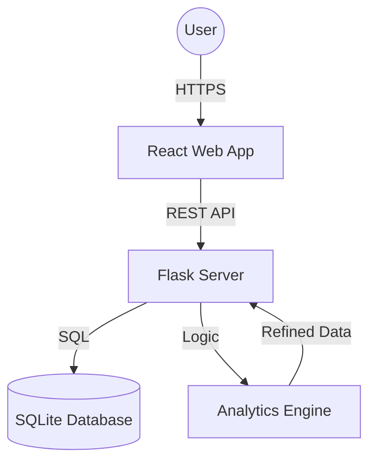

# High-Level Design (HLD): Academic Integrity Risk Intelligence System

## 1. Introduction
### 1.1 Purpose
This document provides a comprehensive high-level design of the Academic Integrity Risk Intelligence System. It serves as a blueprint for developers, project managers, and stakeholders to understand the system's architecture, data flow, and core functionalities.

### 1.2 Scope
*   **In-Scope**: Automated risk analysis of courses, student performance tracking, predictive ML-based risk modeling, real-time administrative dashboards, and notification systems.
*   **Out-of-Scope**: Direct integration with external LMS (like Canvas/Moodle) via LTI (future phase), actual exam proctoring software.

### 1.3 Definitions, Acronyms, Abbreviations
*   **ML**: Machine Learning
*   **Risk Score**: A composite metric (0-100) representing the likelihood of academic integrity violations.
*   **Glassmorphism**: A UI design style characterized by translucent backgrounds and background blur.
*   **Blueprint**: A Flask concept for organizing related routes and logic.

### 1.4 References
*   [Backend Documentation](../backend/README.md)
*   [Frontend Documentation](../frontend/README.md)
*   [Database Schema](../backend/database/schema.sql)

---

## 2. System Overview
### 2.1 Problem Statement
Educational institutions currently rely on manual, reactionary reviews of student grades. This makes it difficult to identify widespread anomalies (like lenient grading or leaked answers) until it's too late. Manual spreadsheet-based tracking is inconsistent and lacks predictive capabilities.

### 2.2 Proposed Solution
A real-time, ML-driven intelligence dashboard that analyzes statistical patterns in student scores and behaviors to flag academic integrity risks before they escalate.

### 2.3 Goals & Objectives
*   **Real-time Monitoring**: Provide instant visibility into course-level risks.
*   **Predictive Insights**: Use ML to identify "at-risk" students based on historical patterns.
*   **Actionable Analytics**: Generate concrete suggestions for intervention.

### 2.4 Assumptions & Constraints
*   **Tech Stack**: Frontend (React), Backend (Flask), Database (SQLite).
*   **Performance**: Must handle at least 1,000+ students and 10+ concurrent courses with sub-second response times.

---

## 3. System Architecture
### 3.1 Architecture Diagram

### 3.2 Technology Stack
*   **Frontend**: React.js (Hooks, Context), Recharts (Visualization), Vanilla CSS (Glassmorphism).
*   **Backend**: Flask (Python), Werkzeug (Security), SQLite3 (Database).
*   **Data Analysis**: Custom statistical algorithms and ML prediction logic.

### 3.3 Design Approach
*   **MVC Pattern**: Separation of Data (SQLite), Presentation (React), and Logic (Flask Blueprints).
*   **3-Tier Architecture**: Client Layer (Browser), Application Layer (Flask), and Data Layer (SQLite).

### 3.4 Deployment View
*   **Local Execution**: Frontend on `localhost:5173`, Backend on `localhost:5000`.

---

## 4. Database Design
### 4.1 ER Diagram
*   **Users**: (id, username, password_hash)
*   **Students**: (id, name)
*   **Courses**: (id, course_name)
*   **Scores**: (student_id, course_id, marks...) -> Linked to Students and Courses.
*   **Student_Analytics**: (student_id, attendance, stress, predicted_risk...) -> One-to-One with Students.

### 4.2 Table Schema
See `backend/database/schema.sql` for precise datatypes and constraints.

### 4.3 Data Dictionary
*   `predicted_risk`: (0/1) - ML generated flag for high-risk profiles.
*   `risk_score`: (0-100) - Aggregated statistical anomaly score.
*   `suggestion`: Human-readable text for intervention.

---

## 5. Functional Flow
### 5.1 Use Case Diagram
*   **Admin**: View system-wide risk, manage financial scholarship distribution, monitor total student counts.
*   **Teacher**: View class-level scatter plots (Attendance vs. Marks), identify high-stress student clusters.
*   **Student**: View personal performance radar charts, receive intelligent suggestions.

### 5.2 Activity Diagrams
**User Login Flow:**
1. Enter credentials.
2. Backend validates via `check_password_hash`.
3. If valid, return mock-token and store in `localStorage`.
4. Frontend redirects to Dashboard and hides Sidebar on auth pages.

### 5.3 Sequence Diagrams
**Risk Analysis Fetch:**
1. Frontend calls `/api/analytics/admin`.
2. Backend queries `scores` and `student_analytics`.
3. Backend runs weighted risk calculations.
4. Response sent to Frontend.
5. Recharts renders histograms and pie charts.

---

## 6. User Interface (Wireframes)
*   **Dashboard**: Sidebar with role-based links, top welcome message, grid of course cards.
*   **Course Detail**: Large histograms showing score distribution anomalies.
*   **Student View**: Radar charts showing "Profile Strength" across multiple dimensions (Attendance, Stress, Marks).

---

## 7. Non-Functional Requirements
### 7.1 Security
*   **Password Hashing**: Using `werkzeug.security` (PBKDF2).
*   **Auth Gates**: Protected routes in React to prevent unauthorized access.
*   **Session Management**: LocalStorage based token persistence.

### 7.2 Scalability
*   The current SQLite implementation is optimized for 1,000-5,000 students.
*   Future path: Migration to PostgreSQL for concurrent multi-user write support.

### 7.3 Usability
*   **Aesthetics**: High-end glassmorphism design.
*   **Responsiveness**: Flexbox/Grid based layout for desktop and tablet views.

---

## 8. Risks & Mitigation
*   **Technical Risk**: SQLite concurrency issues if many admins edit data simultaneously.
    *   *Mitigation*: Use a service-layer queue or migrate to PostgreSQL.
*   **Data Integrity**: Inaccurate manual data entry.
    *   *Mitigation*: Server-side validation on the `/add-data` endpoint.
